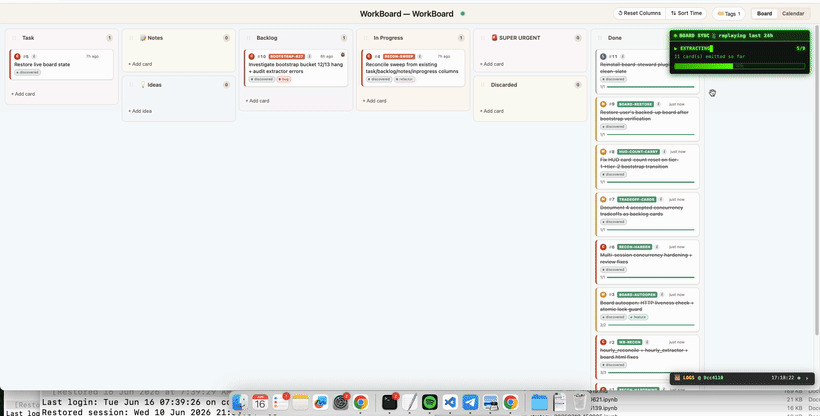
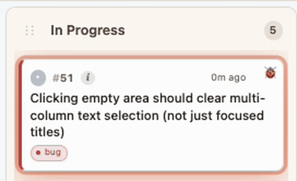
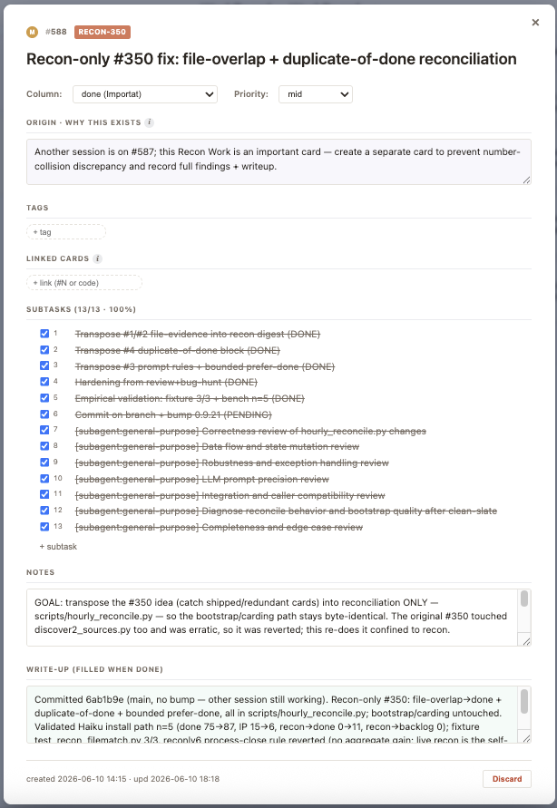

<div align="center">

# 🗂️ WorkBoard

### A live kanban board your Claude Code agent keeps up to date — *on its own*.

**So you never lose an idea, never forget a half-finished task, and never have to ask *"did you update the board?"* again.**

    



<sub>↑ A fresh install: the board mines your past Claude Code sessions and flies them on as cards — `task → in-progress → done`. You open the board on day one and *already see your recent work*.</sub>

</div>

---

## The problem

Working with an AI agent, **ideas pile up fast — and slip away just as fast.** You mention something mid-session, three tangents happen, and it's gone. Branching to-do lists make it worse: task 1 spawns 1.1, which spawns 1.1.1, and task 5 quietly gets forgotten three levels deep. By next week, neither you nor the agent remembers what you shipped, what's half-done, or *why* you started that refactor.

Most "agent memory" tools are **passive stores you have to remember to write to** — so they drift the moment you get busy. That's exactly when you needed them.

## The fix

**WorkBoard gives Claude a live kanban board it keeps in sync by itself.** Every idea, task, and shipped change becomes a **card**, in real time:

- 💡 You mention an idea → a card animates onto the board (with a 5-second Undo).
- 🛠️ Claude starts the work → the card glides to **In Progress** and pulses.
- ✅ Claude ships it → it writes a full summary (what changed, which files, how it was verified) and the card flies to **Done**.

You just glance at `http://127.0.0.1:7891` and see the **entire state of your work** — animated, glanceable, and always current. No typing, no dragging, no "remind the agent." The board can't silently drift, because **hooks make forgetting to track work a self-correcting event.**

> **Design principle: zero input from the user. Work auto-logs. You glance — never type, drag, or configure — and you know everything.**

---

## ✨ What makes it different

### 🔒 Hook-enforced — the board literally can't drift
This is the headline. Four Claude Code hooks keep the agent honest in real time, so tracking isn't a thing the agent *should* do — it's a thing that *happens*:

| Hook | Fires on | What it does |
|---|---|---|
| **SessionStart** | session start | Injects a ~220-token board digest; re-spawns the server if the port died. |
| **UserPromptSubmit** | every prompt | Re-injects the live-lifecycle protocol so work is carded as it happens, never batched at the end. |
| **PreToolUse** | before an Edit/Write | Non-blocking nudge — about to edit a file with no card In-Progress? "Declare a card first." |
| **Stop** | agent ends its turn | Made real edits but ran no `card.py`? It records the gap so the next session reconciles it. Advisory by default (0 tokens, invisible); opt-in strict mode forces same-turn carding. |

The net effect: **the user never has to ask "did you update the board?"** — and that question is the exact failure mode the whole project exists to kill.



<sub>↑ The active card *throbs* in In Progress, so you always know which task Claude is on right now — even with multiple sessions running at once, each has its own pulse.</sub>

### ✅ Subtasks track the real work, step by step
Each card breaks down into the steps the agent will actually take. Subtasks tick off one by one as the work progresses — so even mid-task you can see exactly how far along Claude is (e.g. *2/4*), not just *"in progress."*



### 🐞 Bug? The card flies back out of Done — full history kept
Found a regression in something already shipped? Just tell Claude — or run `card.py bug #N` — and the card animates **back out of Done** into In Progress with a 🐞 tag and a new subtask for the fix. The card's history shows the entire *ship → bug → fix → ship* arc, so the story is never lost.


<sub>↑ Real life isn't a one-way street: cards loop *to and fro* through Done as bugs surface and get fixed — and every loop is on the record.</sub>

### 🔗 Just say *"Do #123."*
Every card has a number. Reference it any time — today, next week, next month — and Claude picks the work up exactly where it left off. No re-explaining context.

### 🧠 Recall months later, for almost no tokens
Three months on, ask *"what did we do on auth in May?"* Claude traverses cards at minimal token cost instead of re-reading whole files or chat logs. The full `board.json` (130 KB+) is **never** loaded into context — Claude reads a tiny digest, then queries only the cards it needs. See [`docs/TOKEN_BUDGET.md`](docs/TOKEN_BUDGET.md) for measured benchmarks vs. claude-mem, mem0, and letta.

### ⚡ Open the board already full — *History Replay*
The onboarding trick no other kanban can do. On install, WorkBoard **mines your past Claude Code sessions and reconstructs them as cards** — flying your recent work onto a fresh board (`task → in-progress → done`, including real bug-bounces). You open the board on day one and *already see your last week of work animate in* — instead of an empty page to fill.

### 🎬 A dashboard, not a database
A live, animated kanban that runs entirely on your machine. Cards pop in with overshoot easing and *glide* between columns (FLIP animation) — they never teleport. Plus a **Calendar** view (*"we shipped 17 things on May 25"*) and a **Velocity** view (throughput, cycle time, blockers). Local, private, no sign-in.

---

## 📦 Installation

WorkBoard runs as a Claude Code plugin. Pick one of two paths.

### Option A — install the plugin (recommended)

In Claude Code:

```
/plugin marketplace add malcolm1232/WorkBoard
/plugin install board-steward@workboard
```

That's it. The plugin self-enables its hooks, bootstraps a board for your current project, and starts the local server. Open **http://127.0.0.1:7891**.

### Option B — one command from a clone

```bash
git clone https://github.com/malcolm1232/WorkBoard
cd WorkBoard

./install.sh                       # set up + bootstrap a board in the current project
./install.sh --project ~/code/foo  # ...or bootstrap a specific project
./install.sh --demo                # isolated dry-run — try it without touching anything
```

### Requirements
- **Claude Code** (the CLI, desktop, or IDE extension)
- **Python 3.9+** (standard library only — no pip install needed for the core board)
- macOS, Linux, or Windows

**No account. No cloud. No config. No API key required** to run the board. (History Replay's optional AI backfill uses Claude Haiku — the cheapest tier — as a one-time, detached subprocess.)

---

## 🚀 Quick start

Once installed, you don't run commands — you just talk to Claude normally. The board fills itself:

```
You:     I have an idea: add dark mode to the settings page
Claude:  ✦ carded as #142 (Ideas)

…three tangents later…

You:     ok, do #142
Claude:  ✦ #142 → In Progress … shipped ✓  (#142 → Done, write-up attached)
```

Then open **http://127.0.0.1:7891** and watch it move.

---

## 🛠️ How it works

- **The board stays in sync by itself.** Bundled Claude Code hooks card work as it happens — the board can't silently drift mid-session.
- **The board is the source of truth — not chat memory.** Claude reads it at session start, updates it as it works, and signs off at session end. Nothing gets dropped between sessions.
- **Token-cheap by design** — a *progressive-disclosure ladder*:
  - `~220-token digest` at session start.
  - CLI primitives — `digest` → `query` (sliced JSON) → `show <n>` (one card) → `board.json` (last resort).
  - The 130 KB+ board file is **never auto-loaded** into context.
- **Crash-safe.** Cross-process `flock` + rolling backups on *every* write; `recover` / `repair-links` CLI if anything ever goes sideways.

Under the hood, Claude drives the board with a small CLI (you rarely touch it directly):

```bash
card.py add --title "…"          # create a card (Ideas / Task)
card.py fly <n> inprogress       # animate a card into In Progress
card.py fly <n> done             # ship it with a written completion summary
card.py show <n>                 # full detail for one card
card.py list --column "In Progress"
```

---

## ⚙️ Configuration (optional)

Everything works out of the box. For power users:

| What | How | Default |
|---|---|---|
| **Strict carding** — force the agent to card work *same-turn* | `export BOARD_STEWARD_STRICT=1` | off (advisory) |
| **Glance from your phone** over LAN | `serve.py --auth-token <token>` | off |
| **Bootstrap a specific project** | `./install.sh --project <path>` | current dir |
| **Try it without touching anything** | `./install.sh --demo` | — |

Autostart is handled for you per-OS (`launchd` / `systemd` / Task Scheduler), so the board is live at login. If autostart ever dies, the SessionStart hook detects the dead port and re-spawns the server in the same turn — you never see a broken board.

---

## 🤔 How is this different from claude-mem / mem0 / letta?

Those are **passive memory stores** — embeddings and recall you query. WorkBoard is a **live, enforced work-tracker**: it's not just *remembering* the past, it's keeping the present honest. The board is a glanceable kanban a human actually looks at, and hooks guarantee the agent updates it without being asked. It's also the **lightest per-prompt** of the peers benchmarked (see [`docs/TOKEN_BUDGET.md`](docs/TOKEN_BUDGET.md)). You can absolutely run both — they solve different halves of "agent memory."

---

## 📚 Learn more

- [`docs/KEY_FEATURES.md`](docs/KEY_FEATURES.md) — the full feature tour
- [`docs/TOKEN_BUDGET.md`](docs/TOKEN_BUDGET.md) — measured token cost vs. peer memory tools
- [`docs/DEVELOPMENT.md`](docs/DEVELOPMENT.md) — repo layout, internals, and contributing
- [`CHANGELOG.md`](CHANGELOG.md) — release history

---

## License

MIT — see [`LICENSE`](LICENSE). Runs 100% on your machine; your boards and chat history never leave it.
